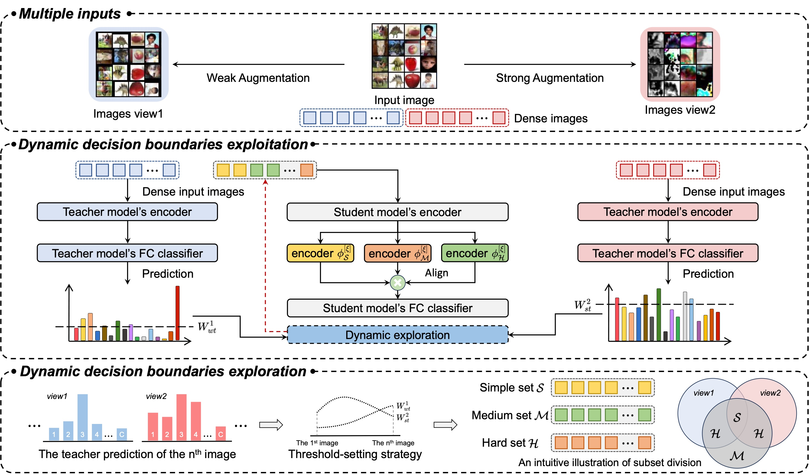

# MLKD

This repo provides a demo for the paper "Multi-level Knowledge Distillation via Dynamic Decision Boundaries Exploration and Exploitation" on the CIFAR-100 dataset.

## Requirements
- python 3.7 (Anaconda version >=5.3.1 is recommended)
- torch (torch version >=1.7.0 is recommended)
- torchvision (torchvision version >=0.10.0 is recommended)
- tensorflow-gpu (tensorflow-gpu version >=2.6.0 is recommended)
- tensorboard-logger (ensorboard-logger version >=0.1.0 is recommended)
- pandas
- numpy
- yacs
- wandb
- tqdm
- tensorboardX
- NVIDIA GPU + CUDA CuDNN

## Datasets
- CIFAR-10, CIFAR-100, CIFAR-100-C, STL-10, Tiny-ImageNet and others

## Getting started
- Download datasets and extract it inside  `data`
- Download [the pre-trained weights of the teacher model.](https://drive.google.com/file/d/1QKl3QwMoNSE1FHdtH_QMdFS7oTstHYOf/view?usp=drive_link) and extract it inside  `download_ckpts\cifar_teachers`
- Student Training: `python /root/code/MLKD/train.py --cfg /root/code/MLKD/configs/cifar100/dkd/our_MLKD_DKD_res56_r20.yaml`
- Evaluate Sample:
  - Distilled student model of vgg16-resnet44 and wrn_40_2-resnet32 for CIFAR-100 are available at this [link](https://drive.google.com/file/d/1pLikCw6jOit12nsyV81OZ03Vng3KNDtu/view?usp=sharing). Download and extract them in the `output` directory.
  - You can achieve the top-1 classification accuracy of 77.10% and 77.48% on CIFAR-100 datasets.

## Acknowledgement
- Thanks for DKD and SSKD. We build this library based on the [DKD's codebase](https://github.com/cvlab-yonsei/DKD) and [SSKD's codebase](https://github.com/xuguodong03/SSKD).